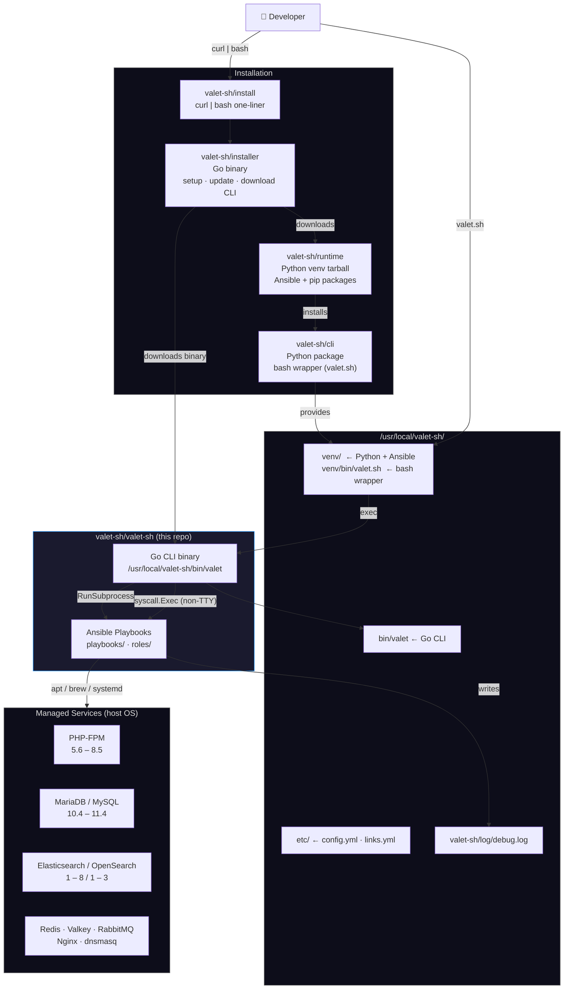
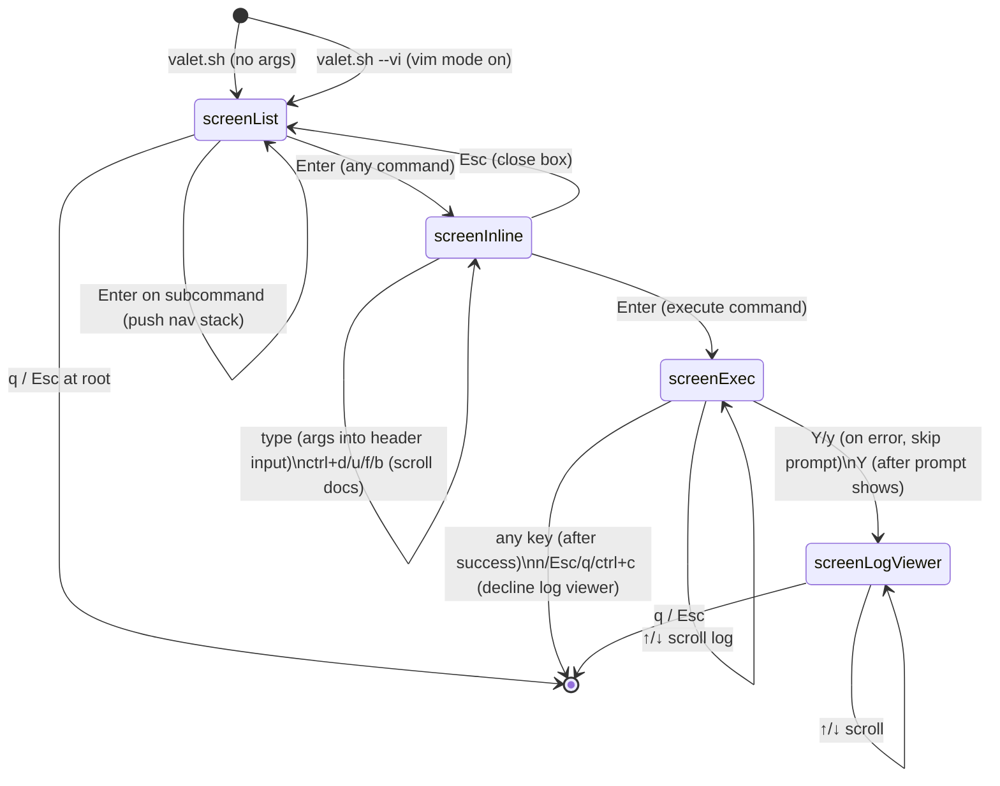
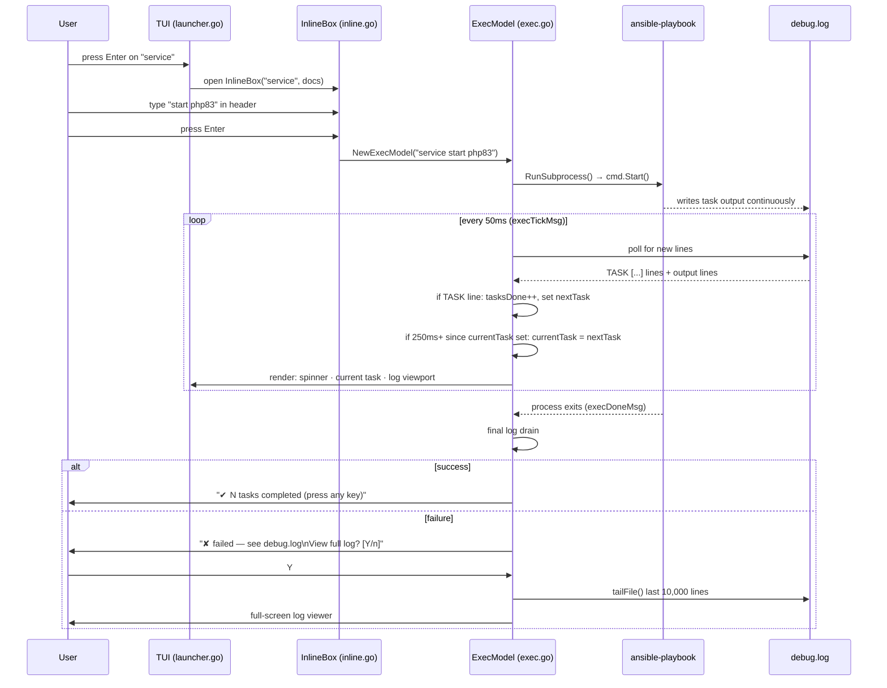

# valet-sh Architecture

## System Overview

How the four repositories work together to deliver a working installation on a developer machine.



---

## TUI State Machine

How the interactive launcher transitions between states.



---

## Execution Flow

What happens when a command runs, from user input to Ansible output.



---

## Colour Palette

All colours use terminal palette indices so the TUI adapts to the user's terminal theme.

| Index | Name | Role in TUI |
|---|---|---|
| `12` | Bright blue | Headers (`▶ valet.sh`), filter prompt, section titles |
| `10` | Bright green | Selected command (`▶`), spinner, task counter, `✔ done` |
| `9` | Bright red | `✘ failed`, error messages |
| `8` | Bright black (dim) | Ghost text, separators `·`, dim hints, unselected commands |
| `7` | Normal foreground | Regular list items, input text, log content |

These indices match the ANSI codes used by the Ansible Python callback plugin
(`plugins/callback/valet-sh.py`) so the TUI and Ansible output feel visually consistent.

---

## CLI Task Display: Real-Time Streaming from Ansible stdout

### Problem Solved

The CLI execution panel needed to display **current Ansible task names in real time** as Ansible moves from task to task, without stalling or showing stale information during long-running operations.

### Root Cause Analysis

The initial implementation streamed task names from Ansible's stdout pipe but task names were not appearing in real time. Investigation revealed:

**Python's Buffering Behavior:**
- The Ansible callback plugin (`/usr/local/valet-sh/valet-sh/plugins/callback/valet-sh.py`) writes task names via `print(..., end="\r")`
- When stdout is connected to a pipe (not a TTY), Python defaults to **full buffering** (8 KB buffer)
- Without explicit `sys.stdout.flush()`, task name writes sit in the buffer until:
  1. Buffer fills (rare; happens after ~100 tasks)
  2. Process exits (common case — all buffered output arrives at once, or not at all for interrupted runs)
- Result: task display showed nothing for entire long-running operations, then suddenly all tasks at the very end

### Solution: Force Line Buffering

Set `PYTHONUNBUFFERED=1` in the Ansible subprocess environment. This forces Python to use **line buffering** for stdout when connected to a pipe, ensuring each `print()` call flushes immediately to the pipe.

**Implementation:**
- `cli/internal/ansible/runner.go:248` — added `"PYTHONUNBUFFERED=1"` to the subprocess environment passed to `ansible-playbook`

**Effect:**
- Each task arrival now generates a separate read from the stdout pipe in real time
- Go goroutine `readTaskCmd()` receives data like `"\x1b[2K\r⠙ taskname\r"` (flush + spinner animation + task name)
- Progress bar updates instantly as Ansible transitions between tasks
- Display naturally reflects what Ansible is currently executing

### Data Flow

```
Ansible callback (stdout pipe)
  ↓
PYTHONUNBUFFERED=1 forces flush
  ↓
Go readTaskCmd() reads "\x1b[2K\r⠙ taskname\r"
  ↓
parseAnsibleTaskLine() extracts "taskname"
  ↓
currentTask updated
  ↓
Progress bar re-renders with new task name
```

### Defensive Parsing Improvements

To handle edge cases and ensure robust task name extraction:

1. **`readTaskCmd()` Internal Loop (exec.go:~635)**
   - Changed behavior: only return on IO error/EOF, not on empty parse results
   - Reason: flush-only reads (`"\x1b[2K\r"` with no task name) would trigger spurious EOF detection
   - Now loops internally reading until it gets a real task name or actual EOF

2. **`parseAnsibleTaskLine()` Spinner Validation (exec.go:~656)**
   - Added `spinnerRunes` map with known braille characters: `⠋⠙⠹⠸⠼⠴⠦⠧⠇⠏`
   - Validates that extracted task names start with a valid spinner rune
   - Prevents play-start lines (`▶ Play Name`) from being misidentified as task names
   - Ensures only actual Ansible task lines are processed

**Test Coverage (`exec_test.go`):**
- 7 test cases for `parseAnsibleTaskLine` covering: normal tasks, flush-only lines, play-start lines, mixed input
- `TestReadTaskCmdSkipsFlushLines` verifies the internal loop behavior
- All tests pass

### Code Changes

**Files modified:**
- `cli/internal/ansible/runner.go` — `PYTHONUNBUFFERED=1` environment variable
- `cli/internal/tui/exec.go` — improved `readTaskCmd()` loop + `parseAnsibleTaskLine()` validation
- `cli/internal/tui/exec_test.go` — expanded test coverage

**Commits:**
- `360c34c` — Initial stdout pipe streaming (had buffering issue)
- `6af1c41` — Previous log-file-based approach (was working but slower)
- Latest — `PYTHONUNBUFFERED=1` fix + defensive parsing improvements (**current design**)

### Why This Works

- **Immediate feedback**: task names appear as soon as Ansible writes them, not minutes later
- **Handles long operations**: when Ansible blocks on a long task (e.g., RabbitMQ startup), the display shows which task is blocking
- **No stale data**: current task always reflects what `ansible-playbook` is executing right now
- **Single-line fix**: `PYTHONUNBUFFERED=1` is minimal, maintainable, and doesn't require modifications to the Ansible callback plugin

### Log Viewer Prompt Interaction

Fixed the "View full log?" prompt to open on single keypress:

1. **Previous design**: 
   - First keypress on error → shows "View full log? [Y/n]" prompt (consumes key)
   - Second keypress (y) → opens log viewer
   - Result: required two keypresses to view log

2. **Current design**:
   - If first keypress is `y/Y` → skip prompt, directly call `loadLogCmd()` (single keystroke)
   - If first keypress is other key → show prompt and wait for response
   - Result: single `y` or `Y` opens log immediately

**Code location:** `cli/internal/tui/exec.go:handleKey()` — error-state branch checks for y/Y and bypasses intermediate prompt state.

**Commit:** `49c1675`
