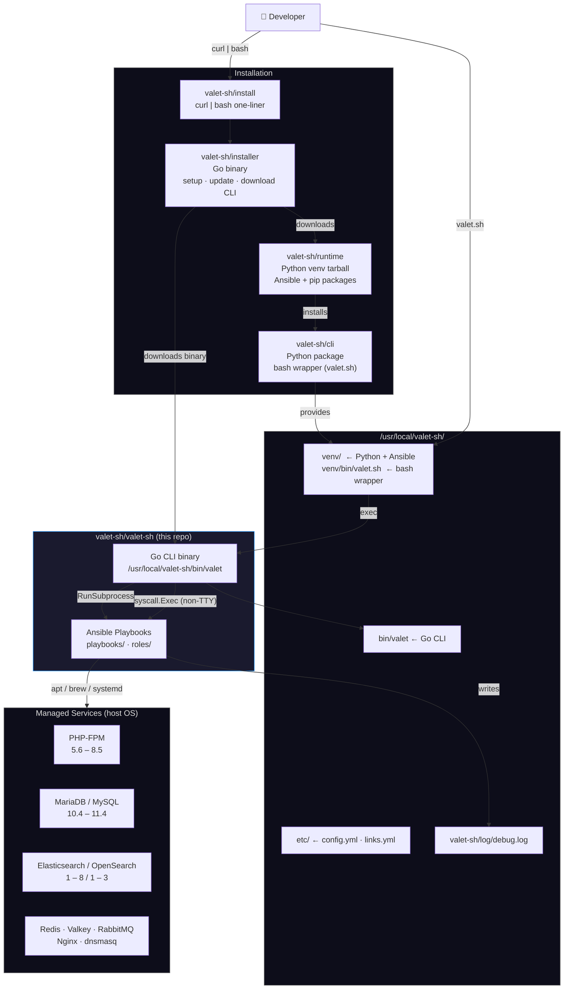
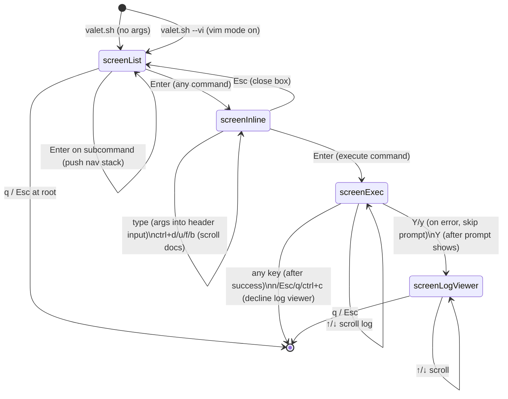
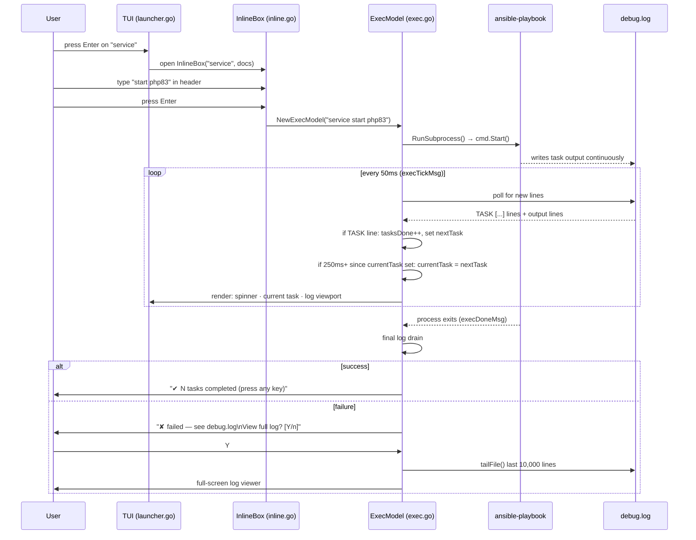

# valet-sh Architecture

## System Overview

How the four repositories work together to deliver a working installation on a developer machine.



---

## TUI State Machine

How the interactive launcher transitions between states.



---

## Execution Flow

What happens when a command runs, from user input to Ansible output.



---

## Colour Palette

All colours use terminal palette indices so the TUI adapts to the user's terminal theme.

| Index | Name | Role in TUI |
|---|---|---|
| `12` | Bright blue | Headers (`▶ valet.sh`), filter prompt, section titles |
| `10` | Bright green | Selected command (`▶`), spinner, task counter, `✔ done` |
| `9` | Bright red | `✘ failed`, error messages |
| `8` | Bright black (dim) | Ghost text, separators `·`, dim hints, unselected commands |
| `7` | Normal foreground | Regular list items, input text, log content |

These indices match the ANSI codes used by the Ansible Python callback plugin
(`plugins/callback/valet-sh.py`) so the TUI and Ansible output feel visually consistent.

---

## CLI Task Display (Direct-Assignment Model)

### Problem Solved

The CLI execution panel needed to display the current Ansible task in a human-readable way without freezing or disconnecting from reality during long-running operations.

**Failed Attempts:**

1. **Initial Design (Queue Model)**: Buffered all discovered tasks in a queue, draining one per tick. This caused:
   - Queue exhaustion: tasks from the first batch (300ms of log output) were consumed in 2-3 seconds
   - Display freeze: once the queue emptied, the display froze at the last task even as Ansible was executing new, long-running operations
   - Historical replay: showed completed tasks from the past rather than what Ansible is currently working on

2. **Second Design (Paced Queue)**: Added a 250ms hold timer per task (dequeue one every 5 ticks). Still failed:
   - Initialization bug: the first batch of ~80 tasks all arrived in the initial 300ms, so `nextTask` was set to each one (last one wins), then the init guard fired immediately. After init, `nextTask` stayed empty until new task lines appeared
   - During long operations (e.g., waiting 60+ seconds for RabbitMQ to start): no new `TASK [...]` lines in the log, so `nextTask` never updated, and the display stayed frozen on the last task from the initial batch
   - The fundamental problem: trying to animate/queue historical tasks instead of directly showing what Ansible is currently on

### Solution: Direct-Assignment Model

Simplified to always show **the most recently discovered task** (what Ansible is currently executing).

**Fields in `ExecModel`:**
- `currentTask string` — human-readable name of the task being displayed
  - Always reflects the most recently discovered task from the log
  - Extracted from `TASK [role : task_name]` lines

**Logic:**

In `appendLine()` and `appendLines()` (called whenever new log lines arrive):
```
if line starts with "TASK [":
    taskName = parse the task name
    if taskName != "":
        currentTask = taskName  // Always show the most recent task
```

**Why This Works:**

- **No queue, no state machine**: just a single `currentTask` field that gets updated to the latest discovered task
- **Naturally shows what's current**: when Ansible runs 80 tasks in 300ms then blocks on task 81 (RabbitMQ wait for 60+ seconds):
  - First 300ms: log lines pour in with 80 `TASK [...]` markers, `currentTask` is updated 80 times, ends at task 81
  - Next 60 seconds: RabbitMQ is running, no new `TASK [...]` lines in the log, `currentTask` stays showing task 81 (which is actually running)
  - Display is never frozen or disconnected from reality
- **User mental model**: "show me what Ansible is doing right now" ← this model delivers exactly that
- **No animation needed**: the spinner animation provides feedback that something is happening

**Historical Context:**

- `517fd52`: Initial queue model (superseded)
- `3e42896`: Paced queue refinement (superseded)  
- `49c1675`: Attempted hold-timer model (reverted due to initialization bug, see problem #2 above)
- Latest: Revert to simpler, correct direct-assignment model ← **current design**

### Log Viewer Prompt Interaction

Fixed the "View full log?" prompt to open on single keypress:

1. **Previous design**: 
   - First keypress on error → shows "View full log? [Y/n]" prompt (consumes key)
   - Second keypress (y) → opens log viewer
   - Result: required two keypresses to view log

2. **Current design**:
   - If first keypress is `y/Y` → skip prompt, directly call `loadLogCmd()` (single keystroke)
   - If first keypress is other key → show prompt and wait for response
   - Result: single `y` or `Y` opens log immediately

**Code location:** `cli/internal/tui/exec.go:handleKey()` — error-state branch checks for y/Y and bypasses intermediate prompt state.

**Commit:** `49c1675` (same commit as hold-timer redesign)
