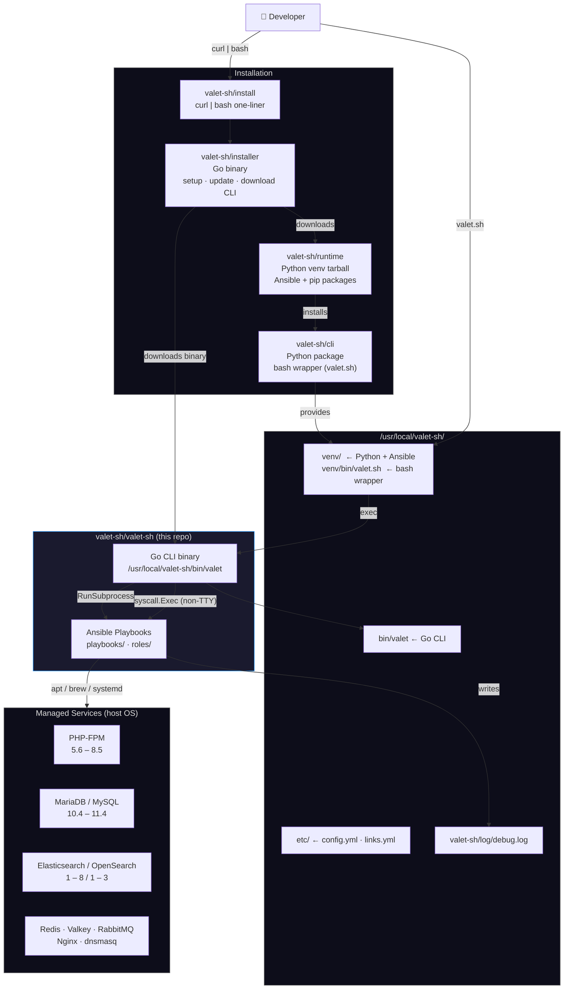
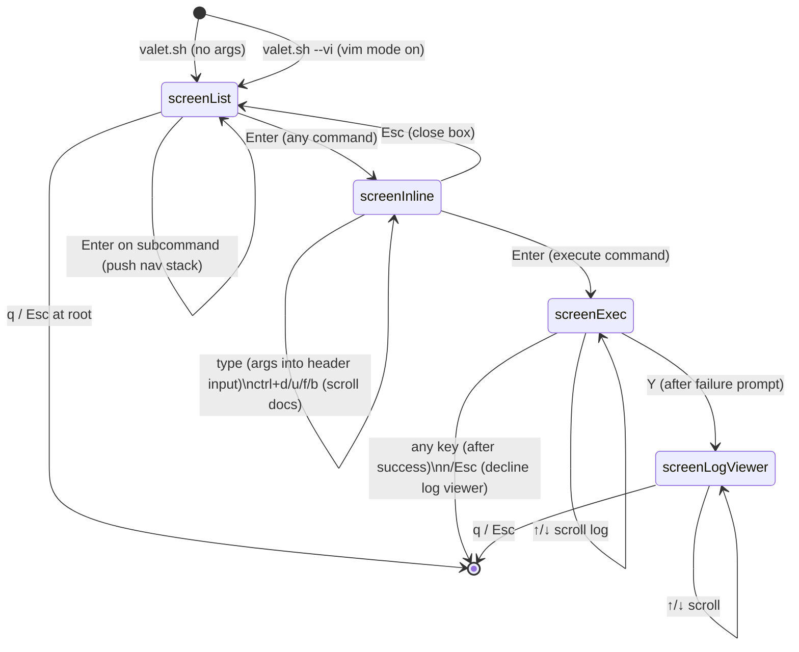
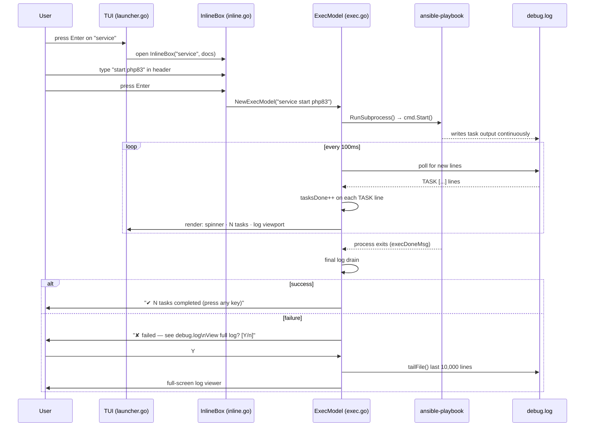

# valet-sh Architecture

## System Overview

How the four repositories work together to deliver a working installation on a developer machine.

---

## TUI State Machine

How the interactive launcher transitions between states.

---

## Execution Flow

What happens when a command runs, from user input to Ansible output.

---

## Colour Palette

All colours use terminal palette indices so the TUI adapts to the user's terminal theme.

| Index | Name | Role in TUI |
|---|---|---|
| `12` | Bright blue | Headers (`▶ valet.sh`), filter prompt, section titles |
| `10` | Bright green | Selected command (`▶`), spinner, task counter, `✔ done` |
| `9` | Bright red | `✘ failed`, error messages |
| `8` | Bright black (dim) | Ghost text, separators `·`, dim hints, unselected commands |
| `7` | Normal foreground | Regular list items, input text, log content |

These indices match the ANSI codes used by the Ansible Python callback plugin
(`plugins/callback/valet-sh.py`) so the TUI and Ansible output feel visually consistent.
